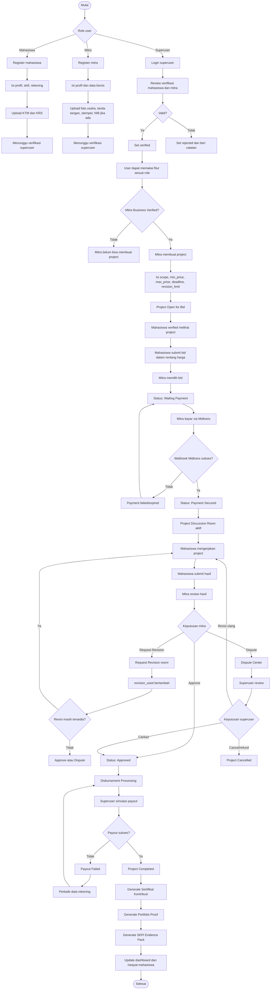
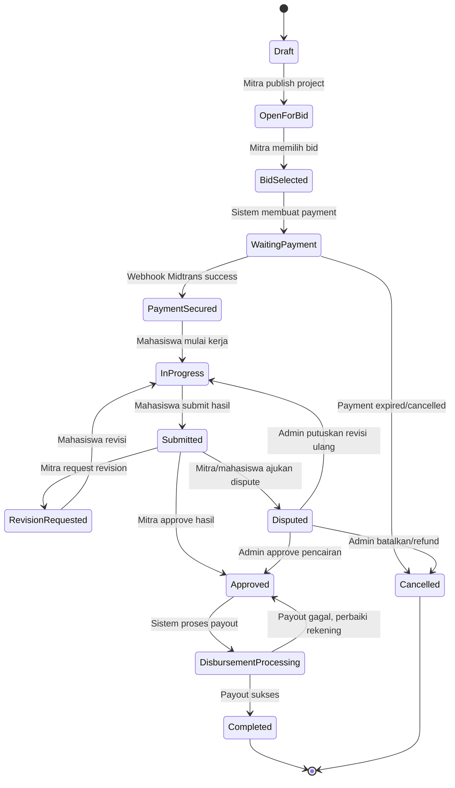
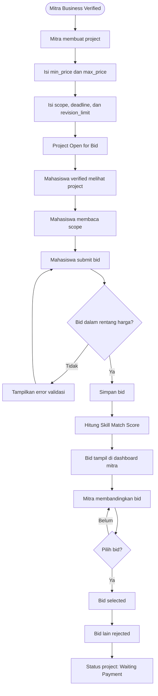
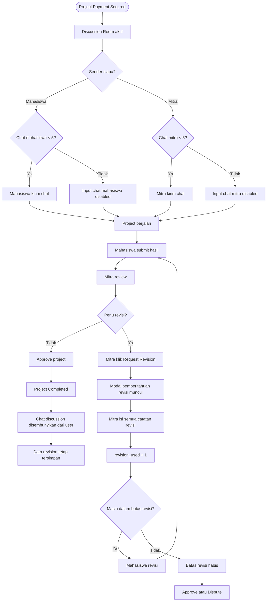
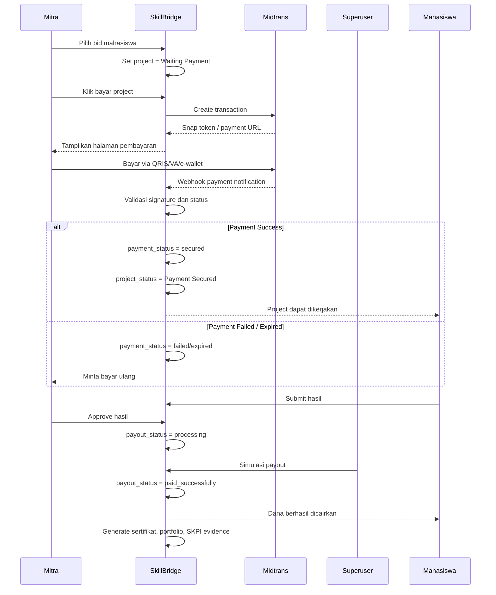

# SkillBridge — Project Specification

## 1. Ringkasan Project

**SkillBridge** adalah platform website micro-project khusus mahasiswa yang menghubungkan **mahasiswa aktif** dengan **mitra/UMKM** untuk mengerjakan project kecil berbayar secara adil, terukur, dan terdokumentasi.

Mitra membuat project dengan **rentang harga minimal dan maksimal** dalam rupiah. Mahasiswa yang sudah terverifikasi dapat mengajukan **bid** di dalam rentang harga tersebut. Mitra kemudian memilih bid yang paling sesuai berdasarkan harga, skill, proposal, estimasi waktu, dan profil mahasiswa. Setelah bid dipilih, mitra membayar ke sistem melalui **Midtrans**. Project baru dapat dikerjakan setelah status pembayaran berhasil diverifikasi melalui **webhook Midtrans**.

Setelah project selesai dan disetujui, dana dicairkan ke mahasiswa melalui **simulasi payout oleh superuser** untuk MVP. Sistem juga membuat **Sertifikat Kontribusi / Sertifikat Rekomendasi SKPI**, **Portfolio Proof**, dan fitur **Student Pro** untuk export portofolio PDF dan fitur premium lainnya.

Project ini tidak menjamin sertifikat otomatis diterima sebagai SKPI di kampus. Sistem hanya menyediakan dokumen pendukung yang dapat digunakan mahasiswa untuk pengajuan SKPI sesuai kebijakan kampus masing-masing.

---

## 2. Tujuan Project

1. Membuat platform micro-project berbayar khusus mahasiswa.
2. Membantu mitra/UMKM mendapatkan bantuan digital dari mahasiswa aktif.
3. Membantu mahasiswa mendapatkan pengalaman nyata, upah, sertifikat kontribusi, dan portofolio otomatis.
4. Menghindari eksploitasi mahasiswa melalui rentang harga, batas revisi, scope kerja, dan payment secured.
5. Membuat proses project terdokumentasi di dalam sistem, bukan melalui WhatsApp.
6. Menyediakan sistem bidding yang fleksibel tetapi tetap aman.
7. Menyediakan sertifikat kontribusi dengan tanda tangan mitra, stempel mitra, dan QR verifikasi sistem.
8. Menyediakan plan Basic dan Pro khusus mahasiswa.
9. Menjaga codebase tetap rapi, type-safe, minim error TSX, dan konsisten.

---

## 3. Role dan Target Pengguna

Role hanya terdiri dari 3:

1. **Mahasiswa**
2. **Mitra**
3. **Superuser**

### 3.1 Mahasiswa

Mahasiswa adalah talent yang mengerjakan project.

Syarat mahasiswa:
- Harus mahasiswa aktif.
- Upload KTM.
- Upload KRS terbaru.
- Mengisi data pribadi.
- Mengisi skill.
- Mengisi data rekening/bank.
- Menunggu verifikasi superuser sebelum dapat bid project.

Data mahasiswa:
- Nama lengkap.
- Email.
- Nomor HP.
- NIM.
- Kampus.
- Program studi.
- Semester.
- Domisili.
- KTM.
- KRS.
- Skill.
- Tools yang dikuasai.
- Link portofolio awal jika ada.
- Nama bank.
- Nomor rekening.
- Nama pemilik rekening.
- Tanda tangan digital mahasiswa.

### 3.2 Mitra

Mitra adalah pihak yang memberikan project.

Mitra dapat berupa:
- UMKM.
- Komunitas.
- Organisasi.
- Startup kecil.
- Lembaga sosial.
- Unit usaha kampus.
- Event organizer.

Data mitra:
- Nama mitra.
- Jenis mitra.
- Nama penanggung jawab.
- Jabatan penanggung jawab.
- Email.
- Nomor HP.
- Alamat.
- Deskripsi bisnis/organisasi.
- Media sosial/website jika ada.
- Foto usaha/logo.
- NIB jika ada.
- File NIB jika ada.
- Tanda tangan mitra.
- Stempel mitra.

### 3.3 Superuser

Superuser adalah admin utama sistem.

Tugas superuser:
- Verifikasi mahasiswa.
- Verifikasi mitra.
- Menangani project bermasalah.
- Menangani dispute.
- Melihat payment Midtrans.
- Memproses simulasi payout ke mahasiswa.
- Mengelola sertifikat.
- Mengelola template portfolio.
- Mengelola Student Pro.
- Melihat dashboard platform.

---

## 4. Verifikasi User

### 4.1 Verifikasi Mahasiswa

Mahasiswa wajib upload:
- KTM.
- KRS terbaru.
- Data pribadi.
- Data rekening.
- Skill.

Status verifikasi mahasiswa:
- `pending`
- `verified`
- `rejected`

Mahasiswa hanya dapat mengajukan bid jika statusnya `verified`.

### 4.2 Verifikasi Mitra

Verifikasi mitra menggunakan progressive verification.

Level verifikasi:
- `basic`
- `business`
- `trusted`

Ketentuan:
- Mitra boleh daftar dengan data sederhana.
- Untuk membuat project di SkillBridge, mitra wajib minimal **Business Verified**.
- NIB tidak harus diwajibkan untuk semua mitra kecil, tetapi menjadi penguat verifikasi.
- Mitra yang belum Business Verified tidak dapat membuat project berbayar karena project akan menghasilkan sertifikat kontribusi.

Syarat Basic Verification:
- Nama mitra.
- Nama penanggung jawab.
- Nomor HP.
- Email.
- Deskripsi usaha.
- Foto usaha/logo/media sosial.

Syarat Business Verification:
- Semua data Basic Verification.
- Alamat bisnis.
- Bukti usaha tambahan.
- NIB jika ada.
- Tanda tangan mitra.
- Stempel mitra.

Syarat Trusted Partner:
- Telah menyelesaikan beberapa project tanpa dispute serius.
- Memiliki rating baik.
- Tidak memiliki riwayat penyalahgunaan fitur.

---

## 5. Jenis Project

Jenis project utama hanya:

> **Paid Micro-Project**

Semua project utama harus berbayar dan menghasilkan sertifikat kontribusi.

Opsi lanjutan yang dapat direkomendasikan oleh sistem atau mitra:
- Magang.
- Kuliah kerja praktik.
- Micro-internship.
- Kerja sama lanjutan.
- Rekrutmen freelance di luar platform.
- Mentorship lanjutan.

Opsi lanjutan ini tidak menjadi fitur utama MVP. Setelah project selesai, sistem dapat menampilkan nomor kontak mahasiswa dan mitra agar mereka dapat melanjutkan komunikasi di luar platform jika keduanya setuju.

---

## 6. Sistem Harga dan Bidding

### 6.1 Harga Project

Mitra menentukan rentang harga:
- `min_price`
- `max_price`

Format harga menggunakan rupiah.

Contoh:
- Harga minimal: Rp100.000
- Harga maksimal: Rp300.000

### 6.2 Bid Mahasiswa

Mahasiswa hanya bisa bid di dalam rentang harga yang ditentukan mitra.

Contoh:
- Project memiliki rentang harga Rp100.000–Rp300.000.
- Mahasiswa dapat bid Rp120.000, Rp150.000, Rp250.000, atau nilai lain dalam rentang tersebut.
- Mahasiswa tidak dapat bid di bawah Rp100.000 atau di atas Rp300.000.

Data bid:
- Harga bid.
- Estimasi pengerjaan.
- Proposal singkat.
- Alasan cocok mengerjakan project.
- Link portofolio relevan.
- Match score berdasarkan skill.

### 6.3 Pemilihan Bid

Mitra berhak memilih bid mana yang disetujui. Mitra tidak harus memilih bid termurah. Mitra dapat mempertimbangkan:
- Skill mahasiswa.
- Proposal.
- Portofolio.
- Estimasi waktu.
- Rating.
- Harga bid.
- Riwayat project mahasiswa.

Setelah bid dipilih:
- Status project menjadi `bid_selected`.
- Project masuk ke tahap `waiting_payment`.
- Sistem akan menghitung **Total Tagihan** = `Harga Bid` + **Biaya Layanan (Platform Fee 3%)**. (Mahasiswa tetap akan menerima *full* sesuai harga bid).
- Mitra harus membayar total tagihan ke sistem melalui Midtrans.
- Mahasiswa belum boleh mulai bekerja sebelum status menjadi `payment_secured`.

---

## 7. Payment Flow

Payment terdiri dari dua tahap.

### 7.1 Tahap 1 — Mitra ke Sistem

Mitra membayar ke sistem menggunakan **Midtrans**. Total pembayaran mencakup Harga Bid yang disepakati ditambah **Biaya Layanan 3%** dari harga bid tersebut.

Alur:
1. Mitra memilih bid.
2. Sistem membuat invoice/payment transaction.
3. Mitra membayar melalui Midtrans.
4. Midtrans mengirim webhook ke endpoint sistem.
5. Sistem memverifikasi webhook.
6. Jika pembayaran berhasil, status project menjadi `payment_secured`.
7. Mahasiswa dapat mulai bekerja.

Status payment:
- `unpaid`
- `pending`
- `secured`
- `failed`
- `expired`
- `refunded`

Webhook Midtrans wajib digunakan untuk update status payment. Status payment tidak boleh hanya berdasarkan klik manual user.

### 7.2 Tahap 2 — Sistem ke Mahasiswa

Karena seluruh uang dari Mitra (Bid + 3% Fee) masuk ke dompet Midtrans milik platform (Admin), pemisahan dana terjadi pada saat **Payout**.
Di dalam database, sistem merekam **Total Pembayaran**, **Biaya Layanan (Platform Fee)**, dan **Net Amount (Hak Mahasiswa)**.

Untuk MVP, pencairan dana dari sistem ke mahasiswa dibuat sebagai **simulasi payout oleh superuser**.

Alur:
1. Project approved oleh mitra.
2. Status payout menjadi `processing`.
3. Superuser membuka dashboard Payout, melihat **Net Amount** yang harus ditransfer ke mahasiswa.
4. Superuser (Platform) menahan 3% sebagai profit di saldo platform, lalu menekan tombol "Simulasi Payout" untuk mentransfer Net Amount ke rekening mahasiswa.
5. Sistem membuat reference ID dummy (menandakan transfer berhasil).
6. Status payout menjadi `paid_successfully`.
7. Sistem membuat receipt.
8. Sertifikat, portfolio, dan SKPI Evidence Pack dibuat.

Status payout:
- `not_requested`
- `processing`
- `paid_successfully`
- `failed`
- `disputed`

Untuk production nanti, simulasi payout dapat diganti dengan layanan disbursement seperti Midtrans IRIS atau payment gateway lain yang mendukung payout.

---

## 8. Project Discussion Room

Setelah project berstatus `payment_secured`, sistem membuka **Project Discussion Room**.

Tujuan chat:
- Konfirmasi brief.
- Tanya bahan project.
- Klarifikasi kebutuhan.
- Diskusi ringan sebelum submit.
- Bukan untuk request revisi resmi.

### 8.1 Batas Chat

Batas chat:
- Mahasiswa maksimal 5 pesan.
- Mitra maksimal 5 pesan.

Alasan:
- Menjaga diskusi tetap singkat.
- Menghindari diskusi terlalu panjang.
- Mendorong scope dan revisi tetap melalui fitur resmi.

Jika batas chat habis, sistem menampilkan pesan:

> Batas diskusi project telah habis. Jika ada perubahan setelah hasil dikirim, gunakan fitur Request Revision agar revisi tercatat resmi.

### 8.2 Chat Setelah Project Done

Setelah project selesai/completed:
- Chat diskusi tidak ditampilkan lagi untuk mahasiswa dan mitra.
- Data chat dapat disembunyikan dari UI.
- Data chat tetap boleh disimpan untuk audit internal superuser.
- Data revisi tetap tersedia dan tidak hilang.

### 8.3 Tidak Ada WhatsApp di Proses Project

Tidak ada tombol WhatsApp untuk diskusi project.

Alasan:
- Revisi tidak dapat dihitung dari WhatsApp.
- Bukti komunikasi sulit diaudit.
- Project harus terdokumentasi di sistem.

Kontak mahasiswa dan mitra baru dapat ditampilkan setelah project selesai jika keduanya ingin melanjutkan kerja sama, magang, kuliah kerja praktik, atau komunikasi lanjutan di luar platform.

---

## 9. Revision System

Revisi resmi hanya dihitung jika diajukan melalui fitur **Request Revision** di platform.

### 9.1 Aturan Revisi

- Revisi hanya dapat diajukan oleh mitra.
- Revisi hanya dapat diajukan setelah mahasiswa submit hasil.
- Satu request revisi dianggap sebagai satu kali revisi.
- Mitra harus menggabungkan seluruh catatan revisi dalam satu request.
- Revisi kecil-kecilan tidak dianjurkan.
- Sistem harus menampilkan pemberitahuan sebelum mitra mengirim request revisi.

Pemberitahuan revisi:

> Gunakan kesempatan revisi dengan bijak. Satu request revisi sebaiknya berisi semua catatan perubahan yang diperlukan. Revisi yang dikirim melalui fitur ini akan dihitung sebagai satu kali revisi resmi.

### 9.2 Revision Counter

Setiap project memiliki:
- `revision_limit`
- `revision_used`

Contoh:
- Batas revisi: 2
- Revisi digunakan: 1 dari 2

Jika revisi habis:
- Mitra tidak dapat lagi request revision.
- Mitra harus approve hasil, membuka dispute, atau membuat project tambahan.

---

## 10. Status Project

Status project:

1. `draft`
2. `open_for_bid`
3. `bid_selected`
4. `waiting_payment`
5. `payment_secured`
6. `in_progress`
7. `submitted`
8. `revision_requested`
9. `waiting_approval`
10. `approved`
11. `disbursement_processing`
12. `completed`
13. `disputed`
14. `cancelled`

Alur normal:

```text
draft
→ open_for_bid
→ bid_selected
→ waiting_payment
→ payment_secured
→ in_progress
→ submitted
→ approved
→ disbursement_processing
→ completed
```

Alur dengan revisi:

```text
submitted
→ revision_requested
→ in_progress
→ submitted
→ approved
```

Alur dengan dispute:

```text
submitted / approved
→ disputed
→ superuser decision
→ completed / cancelled / in_progress
```

---

## 11. Sertifikat Kontribusi / Sertifikat Rekomendasi SKPI

Sistem membuat sertifikat setelah project completed.

Nama fitur:

> **Sertifikat Kontribusi / Sertifikat Rekomendasi SKPI**

Sertifikat diterbitkan oleh **SkillBridge**, dengan:
- Tanda tangan mitra.
- Stempel mitra.
- QR verifikasi dari sistem.
- Project ID.
- Nomor sertifikat.

Sertifikat tidak menjamin otomatis diterima sebagai SKPI. Sertifikat hanya menjadi bukti kontribusi dan dokumen pendukung.

Isi sertifikat:
- Nama mahasiswa.
- NIM.
- Kampus.
- Nama mitra.
- Nama project.
- Deskripsi kontribusi.
- Skill yang digunakan.
- Tanggal mulai.
- Tanggal selesai.
- Durasi project.
- Nomor sertifikat.
- QR verifikasi.
- Tanda tangan mitra.
- Stempel mitra.
- Validasi sistem SkillBridge.

---

## 12. SKPI Evidence Pack

SKPI Evidence Pack adalah paket dokumen pendukung untuk pengajuan SKPI.

Isi:
- Sertifikat Kontribusi.
- Bukti hasil project.
- Link Portfolio Proof.
- Testimoni mitra.
- Rating mitra.
- Durasi pengerjaan.
- Skill yang digunakan.
- QR verifikasi.
- Rekomendasi kategori SKPI.

Rekomendasi kategori:
- Pengabdian masyarakat.
- Karya/produk mahasiswa.
- Project independen.
- Magang/micro-internship, jika mitra memberikan rekomendasi lanjutan.
- Kuliah kerja praktik, jika diakui oleh kampus dan mitra.

---

## 13. Portfolio Otomatis

Setelah project completed, sistem membuat **Portfolio Proof** otomatis.

Isi portfolio:
- Nama mahasiswa.
- Foto/profil mahasiswa.
- Nama project.
- Nama mitra.
- Masalah awal mitra.
- Solusi yang dibuat.
- Skill yang digunakan.
- Link hasil.
- Bukti hasil.
- Rating dan testimoni mitra.
- Tanggal selesai.
- QR verifikasi.
- Project ID.

Portfolio dapat tampil di profile mahasiswa.

---

## 14. Student Plan

Plan hanya berlaku untuk mahasiswa.

### 14.1 Student Basic

Fitur:
- Membuat akun mahasiswa.
- Verifikasi mahasiswa.
- Bid project.
- Mengikuti project.
- Mendapat sertifikat kontribusi.
- Mendapat Portfolio Proof dasar.
- Melihat riwayat project.
- Melihat rating/testimoni.

### 14.2 Student Pro

Fitur:
- Semua fitur Basic.
- Export portfolio ke PDF.
- Portfolio book dari beberapa project.
- Template portfolio premium.
- QR portfolio profile.
- Custom portfolio slug.
- CV summary dari riwayat project.
- Badge skill premium.
- Analytics sederhana untuk jumlah view portfolio.

Mitra tidak memiliki paket berbayar pada MVP.

---

## 15. Fitur Utama MVP

Fitur wajib:
1. Landing page.
2. Register/login.
3. Role mahasiswa, mitra, superuser.
4. Dashboard mahasiswa.
5. Dashboard mitra.
6. Dashboard superuser.
7. Verifikasi mahasiswa dengan KTM dan KRS.
8. Verifikasi mitra dengan progressive verification.
9. Mitra business verified dapat membuat project.
10. Project dengan rentang harga minimal, maksimal, dan **AI-generated Project Brief via Gemini**.
11. Mahasiswa bid dalam rentang harga.
12. Mitra memilih bid.
13. Payment mitra ke sistem via Midtrans.
14. Webhook Midtrans untuk payment secured.
15. Project discussion room dengan batas 5 chat per pihak.
16. Submit hasil project.
17. Request Revision dengan counter.
18. Approval hasil oleh mitra.
19. Simulasi payout oleh superuser.
20. Generate sertifikat kontribusi.
21. Generate Portfolio Proof.
22. Generate SKPI Evidence Pack.
23. Student Basic dan Student Pro.
24. Export portfolio PDF untuk Student Pro.
25. Flowchart dan ERD terdokumentasi.

Fitur yang tidak dibuat dulu:
- WhatsApp chat.
- Payout IRIS asli.
- OCR dokumen.
- Chat real-time kompleks.
- Mitra Pro plan.
- Mobile app.
- AI matching kompleks.
- Verifikasi legal otomatis.
- Kontrak hukum lengkap.

---

## 16. Tech Stack

### 16.1 Core Stack

| Bagian | Teknologi |
|---|---|
| Framework | Next.js App Router |
| Bahasa | TypeScript |
| Styling | Tailwind CSS |
| UI Component | shadcn/ui |
| Icon | Lucide React |
| Animasi | Framer Motion |
| AI Model | Gemini API |
| Database | PostgreSQL |
| ORM | Prisma |
| Validation | Zod |
| Form | React Hook Form |
| Auth | Custom Auth atau Auth.js |
| Payment | Midtrans Snap |
| Webhook | Next.js Route Handler |
| Payout | Simulasi Superuser |
| PDF | React PDF atau Puppeteer |
| QR Code | qrcode |
| Table | TanStack Table |
| Toast | Sonner |
| Deployment | Vercel / VPS |
| File Upload | Local storage untuk MVP atau S3-compatible storage untuk production |

### 16.2 Database

Database menggunakan **PostgreSQL tanpa Supabase**.

Opsi hosting:
- Local PostgreSQL untuk development.
- PostgreSQL di VPS.
- Neon.
- Railway.
- Render PostgreSQL.
- Docker PostgreSQL.

Untuk MVP lokal:
- Gunakan Docker Compose PostgreSQL.
- File upload dapat disimpan ke local `/uploads` atau object storage sederhana.

### 16.3 File Storage

Karena tidak menggunakan Supabase, opsi file storage:

MVP:
- Local storage di folder `/uploads`.
- Simpan path file di database.

Production:
- S3-compatible storage.
- Cloudflare R2.
- AWS S3.
- MinIO jika self-hosted.

File yang disimpan:
- KTM.
- KRS.
- Foto usaha.
- NIB.
- Tanda tangan mitra.
- Stempel mitra.
- Tanda tangan mahasiswa.
- Submission project.
- Sertifikat PDF.
- Portfolio PDF.

---

## 17. Development Rules

Project ini harus menjaga kualitas kode secara ketat.

### 17.1 Type Safety Rules

Wajib:
- TypeScript strict mode aktif.
- Tidak boleh menggunakan `any`.
- Tidak boleh menggunakan `unknown` dan harus langsung divalidasi dengan Zod.
- Semua data dari form harus divalidasi dengan Zod.
- Semua response dari API eksternal harus diparse/validasi.
- Semua komponen memiliki props type yang jelas.
- Semua function memiliki return type jika tidak mudah diinfer.
- Semua enum status dibuat konsisten dari database sampai UI.
- Hindari nullable sembarangan.
- Gunakan union type untuk status.

Tidak boleh:
- `as any`
- `// @ts-ignore`
- `// @ts-expect-error` tanpa alasan kuat
- object bebas tanpa type
- API response langsung dipakai tanpa schema

### 17.2 ESLint Rules

Wajib:
- ESLint aktif.
- Prettier aktif.
- No unused variables.
- No implicit any.
- No floating promises.
- No console log di production code kecuali logger.
- No magic string untuk status.
- No duplicate enum status.

### 17.3 Zod Rules

Gunakan Zod untuk:
- Register mahasiswa.
- Register mitra.
- Create project.
- Submit bid.
- Payment webhook.
- Request revision.
- Submit project.
- Review project.
- Simulate payout.
- Generate certificate.
- Generate portfolio.
- Update profile.

Prinsip:
- `formSchema` untuk client form.
- `serverSchema` untuk server action/API.
- `webhookSchema` untuk Midtrans notification.
- Semua input harus diparse sebelum masuk database.

### 17.4 Prisma Rules

Wajib:
- Semua query melalui Prisma.
- Tidak boleh raw SQL kecuali sangat diperlukan.
- Semua relasi jelas.
- Gunakan transaction untuk proses penting:
  - select bid + waiting payment.
  - payment secured.
  - approve project.
  - payout simulation.
  - generate certificate + portfolio.
- Gunakan enum di Prisma untuk status.

### 17.5 UI Consistency Rules

Wajib:
- Gunakan shadcn/ui untuk komponen utama.
- Gunakan Lucide React untuk icon.
- Gunakan Tailwind utility secara konsisten.
- Gunakan badge status dengan warna konsisten.
- Gunakan format rupiah konsisten.
- Gunakan layout dashboard konsisten.
- Gunakan form validation error yang jelas.
- Gunakan toast untuk success/error.

### 17.6 Security Rules

Wajib:
- Password di-hash.
- Dokumen mahasiswa/mitra tidak boleh public sembarangan.
- Role guard di middleware.
- Server-side authorization untuk semua mutation.
- Mahasiswa tidak bisa melihat dokumen mahasiswa lain.
- Mitra tidak bisa melihat data rekening mahasiswa sebelum project approved/payout.
- Webhook Midtrans harus diverifikasi signature-nya.
- File upload dibatasi tipe dan ukuran.
- QR verification hanya menampilkan data publik yang aman.
- Nomor rekening ditampilkan dalam bentuk masked.

### 17.7 Error Handling Rules

Wajib:
- Semua server action/API route punya try/catch.
- Error ditampilkan dengan pesan manusiawi.
- Jangan expose stack trace ke user.
- Gunakan result pattern jika diperlukan.
- Semua mutation harus mengembalikan status success/error yang typed.

### 17.8 No TSX Error Rule

Untuk mencegah error TSX:
- Gunakan komponen kecil dan terpisah.
- Hindari logic terlalu panjang di JSX.
- Gunakan helper function untuk format rupiah dan status.
- Props komponen wajib typed.
- Jangan mengakses property nullable tanpa guard.
- Gunakan discriminated union untuk status.
- Data yang dipakai client harus sudah dibentuk DTO.
- Hindari passing Prisma model mentah langsung ke client jika ada field sensitif.

---

## 18. Project Structure

```text
skillbridge/
  src/
    app/
      page.tsx
      pricing/page.tsx
      auth/
        login/page.tsx
        register/page.tsx
      dashboard/
        mahasiswa/page.tsx
        mitra/page.tsx
        superuser/page.tsx
      onboarding/
        mahasiswa/page.tsx
        mitra/page.tsx
      projects/
        page.tsx
        create/page.tsx
        [id]/page.tsx
        [id]/bids/page.tsx
        [id]/discussion/page.tsx
        [id]/submit/page.tsx
        [id]/revisions/page.tsx
      portfolio/
        [id]/page.tsx
        [id]/pdf/page.tsx
      verify/
        certificate/[number]/page.tsx
        portfolio/[id]/page.tsx
      api/
        webhooks/
          midtrans/route.ts
        payments/
          create/route.ts
        payouts/
          simulate/route.ts
        certificates/
          generate/route.ts
        portfolios/
          generate/route.ts

    components/
      ui/
      landing/
      dashboard/
      projects/
      bids/
      forms/
      certificates/
      portfolio/
      layout/

    lib/
      auth.ts
      prisma.ts
      rbac.ts
      midtrans.ts
      zod/
      currency.ts
      status.ts
      score.ts
      certificate.ts
      portfolio.ts
      qrcode.ts
      upload.ts
      errors.ts

  prisma/
    schema.prisma
    migrations/
    seed.ts

  public/
    uploads/

  docs/
    projects.md
```

---

## 19. Suggested Prisma Enums

```prisma
enum UserRole {
  MAHASISWA
  MITRA
  SUPERUSER
}

enum VerificationStatus {
  PENDING
  VERIFIED
  REJECTED
}

enum MitraVerificationLevel {
  BASIC
  BUSINESS
  TRUSTED
}

enum ProjectStatus {
  DRAFT
  OPEN_FOR_BID
  BID_SELECTED
  WAITING_PAYMENT
  PAYMENT_SECURED
  IN_PROGRESS
  SUBMITTED
  REVISION_REQUESTED
  WAITING_APPROVAL
  APPROVED
  DISBURSEMENT_PROCESSING
  COMPLETED
  DISPUTED
  CANCELLED
}

enum BidStatus {
  SUBMITTED
  ACCEPTED
  REJECTED
  WITHDRAWN
}

enum PaymentStatus {
  UNPAID
  PENDING
  SECURED
  FAILED
  EXPIRED
  REFUNDED
}

enum PayoutStatus {
  NOT_REQUESTED
  PROCESSING
  PAID_SUCCESSFULLY
  FAILED
  DISPUTED
}

enum StudentPlan {
  BASIC
  PRO
}
```

---

## 20. ERD Mermaid

```mermaid
erDiagram
    USERS {
        uuid id PK
        string name
        string email
        string password_hash
        enum role
        string phone
        enum status
        datetime created_at
        datetime updated_at
    }

    STUDENT_PROFILES {
        uuid id PK
        uuid user_id FK
        string nim
        string university
        string study_program
        int semester
        string domicile
        string ktm_file_url
        string krs_file_url
        string signature_url
        enum verification_status
        text verification_note
        enum plan
        datetime verified_at
    }

    STUDENT_BANK_ACCOUNTS {
        uuid id PK
        uuid student_id FK
        string bank_name
        string account_number
        string account_holder_name
        enum verification_status
        datetime created_at
    }

    MITRA_PROFILES {
        uuid id PK
        uuid user_id FK
        string mitra_name
        enum mitra_type
        string responsible_person
        string position
        string address
        text description
        string social_media_url
        string website_url
        string nib_number
        string nib_file_url
        string business_photo_url
        string logo_url
        string signature_url
        string stamp_url
        enum verification_level
        enum verification_status
        text verification_note
        datetime verified_at
    }

    SKILLS {
        uuid id PK
        string name
        string category
    }

    STUDENT_SKILLS {
        uuid id PK
        uuid student_id FK
        uuid skill_id FK
        enum level
    }

    PROJECTS {
        uuid id PK
        uuid mitra_id FK
        string title
        text description
        string category
        int min_price
        int max_price
        int deadline_days
        int revision_limit
        int revision_used
        enum status
        int fair_work_score
        datetime published_at
        datetime created_at
        datetime updated_at
    }

    PROJECT_SCOPES {
        uuid id PK
        uuid project_id FK
        text included_scope
        text excluded_scope
        string output_format
        int output_quantity
        text completion_criteria
        text required_materials_from_mitra
    }

    PROJECT_SKILLS {
        uuid id PK
        uuid project_id FK
        uuid skill_id FK
    }

    BIDS {
        uuid id PK
        uuid project_id FK
        uuid student_id FK
        int bid_price
        int estimated_days
        text proposal_message
        string portfolio_link
        int match_score
        enum status
        datetime created_at
    }

    PROJECT_ASSIGNMENTS {
        uuid id PK
        uuid project_id FK
        uuid bid_id FK
        uuid student_id FK
        datetime assigned_at
        enum status
    }

    PROJECT_DISCUSSIONS {
        uuid id PK
        uuid project_id FK
        uuid sender_id FK
        text message
        string attachment_url
        enum sender_role
        bool hidden_after_completed
        datetime created_at
    }

    REVISIONS {
        uuid id PK
        uuid project_id FK
        uuid requested_by FK
        int revision_number
        text revision_note
        string attachment_url
        enum status
        datetime requested_at
        datetime submitted_at
    }

    PROJECT_SUBMISSIONS {
        uuid id PK
        uuid project_id FK
        uuid student_id FK
        string file_url
        string result_link
        text submission_note
        enum status
        datetime submitted_at
    }

    REVIEWS {
        uuid id PK
        uuid project_id FK
        uuid reviewer_id FK
        uuid reviewed_student_id FK
        int rating
        text testimonial
        datetime created_at
    }

    PAYMENTS {
        uuid id PK
        uuid project_id FK
        uuid mitra_id FK
        int amount
        string gateway
        string order_id
        string transaction_id
        enum payment_status
        string payment_method
        datetime paid_at
        datetime created_at
    }

    PAYMENT_WEBHOOK_LOGS {
        uuid id PK
        uuid payment_id FK
        string gateway
        string event_type
        string transaction_status
        json payload
        datetime received_at
    }

    PAYOUTS {
        uuid id PK
        uuid project_id FK
        uuid student_id FK
        int amount
        string destination_bank
        string destination_account_masked
        string reference_id
        enum payout_status
        text failure_reason
        datetime processed_at
        datetime paid_at
    }

    CERTIFICATES {
        uuid id PK
        uuid project_id FK
        uuid student_id FK
        uuid mitra_id FK
        string certificate_number
        string certificate_file_url
        string qr_verification_url
        enum status
        datetime generated_at
    }

    PORTFOLIOS {
        uuid id PK
        uuid student_id FK
        uuid project_id FK
        string title
        text problem_summary
        text solution_summary
        string result_link
        string portfolio_page_url
        string qr_verification_url
        enum visibility
        datetime created_at
    }

    SKPI_EVIDENCE_PACKS {
        uuid id PK
        uuid project_id FK
        uuid student_id FK
        string evidence_file_url
        string recommended_category
        string qr_verification_url
        datetime generated_at
    }

    DISPUTES {
        uuid id PK
        uuid project_id FK
        uuid opened_by FK
        text reason
        string evidence_url
        enum status
        text admin_decision
        datetime created_at
        datetime resolved_at
    }

    USERS ||--o| STUDENT_PROFILES : has
    USERS ||--o| MITRA_PROFILES : has
    USERS ||--o{ PROJECT_DISCUSSIONS : sends
    USERS ||--o{ DISPUTES : opens

    STUDENT_PROFILES ||--o{ STUDENT_BANK_ACCOUNTS : owns
    STUDENT_PROFILES ||--o{ STUDENT_SKILLS : has
    STUDENT_PROFILES ||--o{ BIDS : submits
    STUDENT_PROFILES ||--o{ PROJECT_ASSIGNMENTS : assigned
    STUDENT_PROFILES ||--o{ PROJECT_SUBMISSIONS : uploads
    STUDENT_PROFILES ||--o{ PAYOUTS : receives
    STUDENT_PROFILES ||--o{ CERTIFICATES : receives
    STUDENT_PROFILES ||--o{ PORTFOLIOS : owns
    STUDENT_PROFILES ||--o{ SKPI_EVIDENCE_PACKS : receives

    SKILLS ||--o{ STUDENT_SKILLS : used_by
    SKILLS ||--o{ PROJECT_SKILLS : required_in

    MITRA_PROFILES ||--o{ PROJECTS : creates
    MITRA_PROFILES ||--o{ PAYMENTS : pays
    MITRA_PROFILES ||--o{ CERTIFICATES : signs

    PROJECTS ||--|| PROJECT_SCOPES : has
    PROJECTS ||--o{ PROJECT_SKILLS : requires
    PROJECTS ||--o{ BIDS : receives
    PROJECTS ||--o| PROJECT_ASSIGNMENTS : has
    PROJECTS ||--o{ PROJECT_DISCUSSIONS : contains
    PROJECTS ||--o{ REVISIONS : has
    PROJECTS ||--o{ PROJECT_SUBMISSIONS : receives
    PROJECTS ||--o{ REVIEWS : gets
    PROJECTS ||--o| PAYMENTS : has
    PROJECTS ||--o| PAYOUTS : has
    PROJECTS ||--o| CERTIFICATES : generates
    PROJECTS ||--o| PORTFOLIOS : generates
    PROJECTS ||--o| SKPI_EVIDENCE_PACKS : generates
    PROJECTS ||--o{ DISPUTES : may_have

    BIDS ||--o| PROJECT_ASSIGNMENTS : selected_as
    PAYMENTS ||--o{ PAYMENT_WEBHOOK_LOGS : logs
```



---

## 21. Flowchart Utama Mermaid



---

## 22. Flowchart Status Project



---

## 23. Flowchart Bidding



---

## 24. Flowchart Chat dan Revisi



---

## 25. Flowchart Payment dan Webhook Midtrans



---

## 26. Landing Page

Landing page ditampilkan sebelum login.

Section landing page:
1. Hero.
2. Masalah mahasiswa dan mitra.
3. Solusi SkillBridge.
4. Cara kerja.
5. Fitur utama.
6. Student Plan.
7. Keamanan dan verifikasi.
8. CTA daftar sebagai mahasiswa/mitra.

Hero copy:

> Bangun portofolio nyata dari project berbayar bersama mitra lokal.

Subcopy:

> SkillBridge menghubungkan mahasiswa aktif dengan mitra/UMKM melalui micro-project berbayar, sistem bidding, payment secured, batas revisi, sertifikat kontribusi, dan portofolio otomatis.

CTA:
- Daftar sebagai Mahasiswa.
- Daftar sebagai Mitra.

---

## 27. Novelty Project

Novelty utama SkillBridge:

1. Student-only verified talent.
2. Bid-based paid micro-project.
3. Business verified mitra sebelum membuat project.
4. Payment secured melalui Midtrans sebelum mahasiswa bekerja.
5. Chat internal terbatas agar diskusi tetap fokus.
6. Revisi resmi melalui Request Revision, bukan chat bebas.
7. Sertifikat kontribusi dengan tanda tangan mitra, stempel mitra, dan QR verifikasi.
8. Portfolio otomatis dari project selesai.
9. Student Pro untuk portfolio PDF dan portfolio book.
10. SKPI Evidence Pack sebagai dokumen pendukung yang realistis dan tidak berlebihan klaim.

Kalimat novelty:

> SkillBridge bukan marketplace freelance biasa, melainkan platform micro-project khusus mahasiswa yang menggabungkan bidding berbayar, verifikasi mahasiswa aktif, verifikasi mitra, payment secured, revision tracker, sertifikat kontribusi, dan portofolio otomatis dalam satu alur project yang adil dan terdokumentasi.

---

## 28. Dampak Project

### Untuk Mahasiswa

- Mendapat upah.
- Mendapat pengalaman nyata.
- Mendapat sertifikat kontribusi.
- Mendapat portfolio otomatis.
- Mendapat dokumen pendukung SKPI.
- Terlindungi dari revisi tidak terbatas.
- Terlindungi karena project baru dimulai setelah payment secured.

### Untuk Mitra

- Mendapat bantuan project digital.
- Dapat memilih mahasiswa melalui sistem bid.
- Project memiliki scope jelas.
- Revisi lebih teratur.
- Output terdokumentasi.
- Dapat memberi rekomendasi magang atau kerja praktik lanjutan.

### Untuk Kampus/Komunitas

- Aktivitas mahasiswa lebih terdokumentasi.
- Kontribusi mahasiswa ke masyarakat dapat dibuktikan.
- Project bisa menjadi jembatan pengabdian masyarakat, karya mahasiswa, dan pengalaman kerja.

---

## 29. Kriteria Demo MVP

Demo dianggap berhasil jika dapat menunjukkan:

1. Landing page tampil.
2. Mahasiswa register dan upload KTM/KRS.
3. Mitra register dan submit verifikasi business.
4. Superuser memverifikasi mahasiswa dan mitra.
5. Mitra membuat project dengan min/max price.
6. Mahasiswa bid dalam rentang harga.
7. Mitra memilih bid.
8. Mitra membayar via simulasi/Midtrans sandbox.
9. Webhook membuat status payment secured.
10. Discussion room aktif dengan limit 5 chat per pihak.
11. Mahasiswa submit hasil.
12. Mitra request revision dan counter bertambah.
13. Mahasiswa submit ulang.
14. Mitra approve.
15. Superuser simulasi payout.
16. Sertifikat dibuat.
17. Portfolio Proof dibuat.
18. SKPI Evidence Pack dibuat.
19. Student Pro dapat export portfolio PDF.

---

## 30. Kesimpulan

SkillBridge adalah platform micro-project berbayar khusus mahasiswa yang mempertemukan mahasiswa aktif dengan mitra/UMKM melalui sistem bidding, payment secured, revision tracker, sertifikat kontribusi, dan portofolio otomatis.

Project ini menjaga keadilan untuk mahasiswa melalui verifikasi mahasiswa aktif, payment secured sebelum kerja, batas revisi, chat internal terbatas, dan scope kerja yang jelas. Mitra tetap mendapat fleksibilitas melalui rentang harga dan pemilihan bid mahasiswa.

Secara teknis, project menggunakan Next.js, TypeScript, PostgreSQL, Prisma, Zod, Tailwind CSS, shadcn/ui, Lucide React, Framer Motion, Midtrans, dan strict type-safety rules agar codebase konsisten dan minim error.
